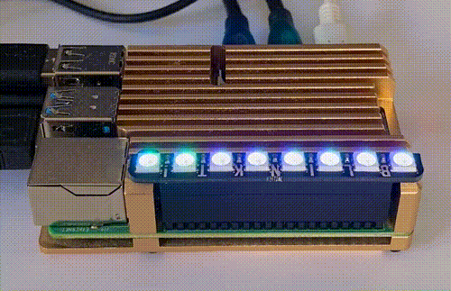

# Blinkt! LED scripts

Display some diagnostic info using Pimoroni's excellent [Blinkt!](https://shop.pimoroni.com/products/blinkt) LED strip for the Raspberry Pi. Requires the Blinkt! [python library](https://github.com/pimoroni/blinkt).

## Scripts

* `blinktheat.py` - CPU tempurature bar
* `blinktcpus.py` - per-core CPU load (pictured) 
* `blinkttop.py` - CPU load, memory, disk, network, CPU temp